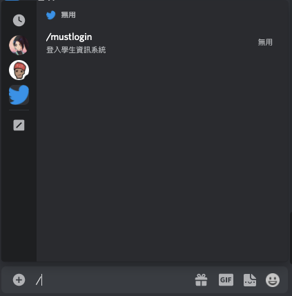
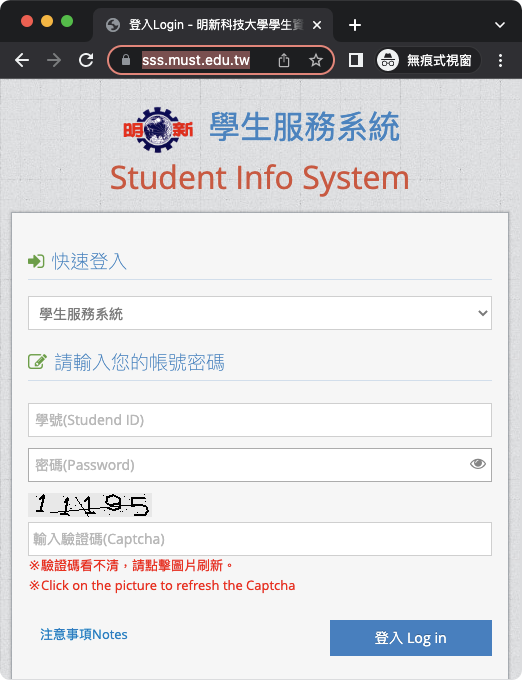
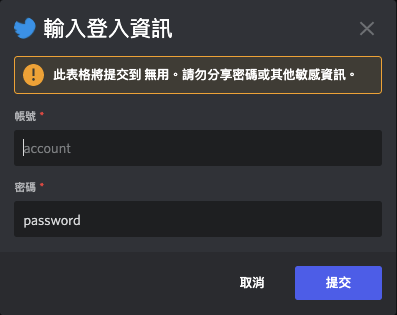
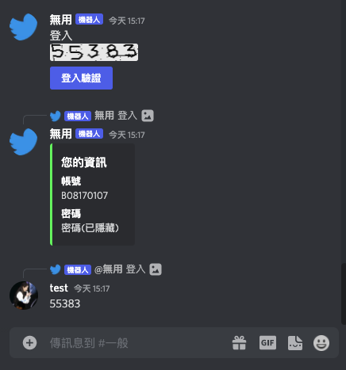
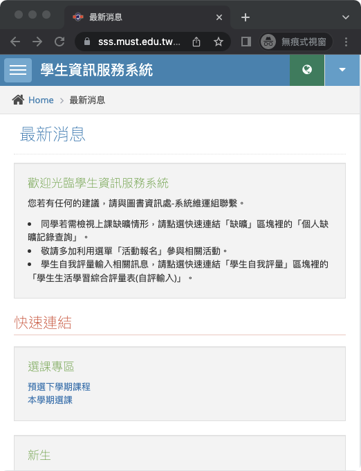

# 使用 Discord bot 智能化操作

## 以往都要透過學生資訊系統、Tronclass 系統來查詢固定資料，例如：課表資訊、出缺席紀錄、考試時間...作業繳交時間等等，且需要透過層層步驟，先到 Google 查詢指定系統，進入系統再輸入帳號密碼，在尋找所要查詢的資料，非常的麻煩。我們可以透過比 LINE 功能更完善更豐富的 Discord 平台，來達到智能化系統，省去那些繁瑣的操作與不必要時間，可選的保存您的帳號資訊並自動登入抓取所需訊息，立刻回應給使用者

## 以下示範範例 code 來登入後取得權限，登入有權限之後即可透過熟悉的爬蟲取得任何資料，網頁形式有變需自己對應 selenium, beautifulsoup, playwright 來實作

簡單讓 bot 上線

```python
import os
import discord
# 建立bot 指令前綴字符為 ! intents設定為開啟所有功能
bot = discord.ext.commands.Bot(command_prefix='!', intents=discord.Intents.all())
# 使用環境變數設定的discord_token來存取並啟動bot
bot.run(os.environ.get("DISCORD_TOKEN"))
```

搭配 cog 可以方便管理各項功能

```python
# cog模組運作方式為在bot主程式載入cog的setup

from discord.ext import commands
from discord.commands import slash_command # 斜線指令

class ping(commands.Cog):

    def __init__(self, bot):
        self.bot = bot

    @slash_command(description="ping")
    async def ping(self, ctx: ApplicationContext):
        await ctx.respond(f'Pong! In {round(self.bot.latency * 1000)}ms')

def setup(bot):
    bot.add_cog(ping(bot))
```

##實作範例：

###流程:

- 在 discord 使用斜線指令
- (這時候伺服器會開啟網頁並抓取驗證碼附圖回傳)
- 輸入所需資訊 (範例版本需手動回覆驗證碼)
- 使用者所看到的所有範例流程畫面
- (伺服器網頁已登入 可以操作網頁網頁也就是取得權限)

<br>

### 程式碼:

configparser 用來存取設定<br>
playwright 模擬網頁互動<br>
py-card 是 discord 的第三方 api<br>

我們透過bot啟動後會載入must模組，當使用者下斜線指令會觸發must_login函數，程式就會透過playwright開啟學生資訊系統網頁並回傳一個驗證碼的圖與帳密表單，使用者填完表單且回傳驗證碼後程式會透過playwright接續執行登入的動作
- bot.py

```python
import configparser
from discord import Intents
from discord.ext import commands

# 這裡改用ini來保存設定與各項token
conf = configparser.ConfigParser()
conf.read('config.ini')

bot = commands.Bot(
    command_prefix=commands.when_mentioned_or(conf.get('setting', 'Prefix')), # 當使用者tag或是使用ini所設定指令皆可觸發
    intents=Intents.all()
)
#cog 需要載入 (這裡載入稍後說明的must.py)
bot.load_extension('must')

if __name__ == "__main__":
    # 使用ini設定的token啟動bot
    bot.run(conf.get('setting', 'TOKEN'))
```

- must.py

```python
import asyncio
from io import BytesIO
from PIL import Image
from discord import (
    ApplicationContext,
    File,
    Interaction,
    Embed,
    ui,
    ButtonStyle,
    EmbedField,
    Color,
    Message
)
from discord.ext import commands
from discord.ui import InputText, Modal
from discord.commands import slash_command, Option
from playwright.async_api import async_playwright

# 這是一個表單 來自discord.ui.Modal 可以建立互動表單
class MyModal(Modal):
    def __init__(self, *args, **kwargs) -> None:
        # 建立兩個InputText
        super().__init__(
            InputText(
                label="帳號",
                placeholder="account",
            ),
            InputText(
                label="密碼",
                value="password",
            ),
            *args,
            **kwargs,
        )
    # 接收返回資訊
    async def callback(self, interaction: Interaction): # interaction為discord其中一返回參數
        embed = Embed(
            title="您的資訊",
            fields=[
                EmbedField(name="帳號", value=self.children[0].value, inline=False),
                EmbedField(name="密碼", value="密碼(已隱藏)", inline=False),
            ],
            color=Color.random(),
        )
        await interaction.response.send_message(embeds=[embed])# 回應使用者接收到的帳號密碼資訊

# 主類別
class must(commands.Cog):

    def __init__(self, bot):
        self.bot = bot

    @slash_command(name="mustlogin", description="登入學生資訊系統")
    async def must_login(self, ctx: ApplicationContext): # ApplicationContext為discord其中一返回參數

        # 這是一個組視圖
        class MyView(ui.View):
            @ui.button(label="登入驗證", style=ButtonStyle.primary)
            async def button_callback(self, button: ui.Button, interaction: Interaction):
                self.modal = MyModal(title="輸入登入資訊")
                await interaction.response.send_modal(self.modal)

        view = MyView()

        async with async_playwright() as pw: # 開啟一個playwright
            self.browser = await pw.chromium.launch(headless=False, channel="chrome")
            self.context = await self.browser.new_context(locale="zh-tw", viewport={"width": 520, "height": 600}) #解析度設定為520x600 方便稍後取得驗證碼
            self.page = await self.context.new_page() # 開啟新分頁
            await self.page.goto("https://sss.must.edu.tw/") # 到指定網址
            img = Image.open(BytesIO(await self.page.screenshot())) # pil讀取來自網頁的截圖
            img = img.crop((28, 414, 152, 438)) # 裁切驗證碼圖片
            with BytesIO() as img_binary:
                img.save(img_binary, 'PNG')
                img_binary.seek(0)
                # 傳送驗證碼
                await ctx.interaction.channel.send(
                    content="登入",
                    file=File(fp=img_binary, filename='validcode.png'),
                    view=view)

            # 這部分在等待驗證以及是否超時
            def check(m: Message):
                return m.author == ctx.author and m.channel == ctx.channel

            try:
                verify: Message = await self.bot.wait_for("message", check=check, timeout=35.0)
            except TimeoutError:
                return await ctx.send_followup("超過驗證時間")

            # 接收到帳號密碼與驗證碼後 登入
            await self.page.locator("[placeholder=\"學號\\(Studend ID\\)\"]").click()
            await self.page.locator("[placeholder=\"學號\\(Studend ID\\)\"]").fill(view.modal.children[0].value)
            await self.page.locator("[placeholder=\"密碼\\(Password\\)\"]").click()
            await self.page.locator("[placeholder=\"密碼\\(Password\\)\"]").fill(view.modal.children[1].value)
            await self.page.locator("[placeholder=\"輸入驗證碼\\(Captcha\\)\"]").click()
            await self.page.locator("[placeholder=\"輸入驗證碼\\(Captcha\\)\"]").fill(verify.content)
            await self.page.click("button:has-text(\"登入 Log in\")")
            await asyncio.sleep(10) # 等候10秒 此為展示成果 實作可以刪除
            await self.context.close()
            await self.browser.close()


def setup(bot):
    bot.add_cog(must(bot))
```
